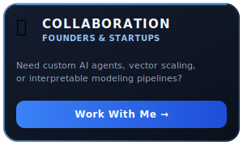
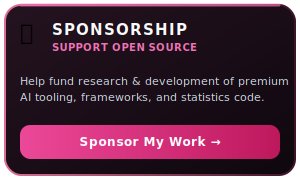
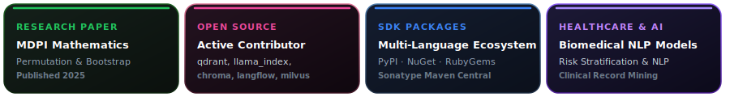

<!-- ===================================================== -->
<!-- 🌌 ADVANCED GITHUB PROFILE README — CLEAN & PREMIUM -->
<!-- ===================================================== -->

  

  

<!-- ========================================== -->
<!-- 🚀 DYNAMIC CALL-TO-ACTION CARD DECK        -->
<!-- ========================================== -->
<table align="center" width="100%">
  <tr>
    <td align="center" width="33%" valign="top">
      
    </td>
    <td align="center" width="33%" valign="top">
      
    </td>
    <td align="center" width="33%" valign="top">
      
    </td>
  </tr>
</table>

 

  
  &nbsp;
  
  &nbsp;
  
  &nbsp;
  

  📌 <strong>AI Systems Engineer &amp; Open Source Builder</strong> specializing in <strong>Interpretable ML</strong>, <strong>Vector Databases (Qdrant/Chroma)</strong>, and <strong>Custom AI Agents</strong> for global startups &amp; research teams.

---

## 💬 A Short Conversation

  

  

  

---

## 🏆 Profile Highlights

  

---

## 🧠 Research & Engineering Philosophy

> **"Models should not only predict well — they should explain well."**

I approach modeling through three core principles:
1. **Statistical validity before scale** — Ensuring assumptions and tests are mathematically grounded before scaling computation.
2. **Interpretability before optimization** — Understanding feature importance and logic paths before squeezing marginal decimal gains.
3. **Domain meaning before deployment** — Ensuring features translate directly to clinical or business reality.

My research interests include:
* Permutation-based, resampling, and nonparametric inference
* Interpretable and explainable machine learning (post-hoc & intrinsic)
* Dimensionality reduction with geometric and statistical intuition
* Robustness, stability, and noise-aware modeling
* Translating statistical theory into clinically actionable insights

---

## 🛠️ Technical Skill Matrix

| Category | Technologies |
| :--- | :--- |
| **🧠 Modeling & AI** | `Python`, `R`, `PyTorch`, `TensorFlow`, `scikit-learn` |
| **🔧 Infrastructure & Pipelines** | `Docker`, `PostgreSQL`, `AWS`, `GCP`, `Git`, `CI/CD Workflows` |
| **📦 Multi-Language Dev** | `TypeScript / Node.js`, `Java (Maven)`, `C# (.NET)`, `Ruby` |

---

## 📊 GitHub Activity

  

---

## 🚀 Featured Open Source Projects

<table width="100%">
  <tr>
    <td width="50%" valign="top">
      <h4>📄 <a href="https://github.com/saitejabandaru-in/papersearch-mcp">papersearch-mcp</a></h4>
        
      
Integrates arXiv and Semantic Scholar directly into AI IDEs with page-level PDF extraction and citation graph traversal.

    </td>
    <td width="50%" valign="top">
      <h4>🧬 <a href="https://github.com/saitejabandaru-in/nf-risk-stratification">nf-risk-stratification</a></h4>
        
      
Nonparametric Combination (NPC) and bootstrap-based clinical risk stratification model for rare-disease clinical research.

    </td>
  </tr>
  <tr>
    <td width="50%" valign="top">
      <h4>🏥 <a href="https://github.com/saitejabandaru-in/clinical-nlp-ai-platform">clinical-nlp-ai-platform</a></h4>
        
      
Clinical NLP platform for unstructured record mining, entity extraction, clinical sentiment analysis, and automated ICD coding.

    </td>
    <td width="50%" valign="top">
      <h4>📊 <a href="https://github.com/saitejabandaru-in/big-data-clustering-analytics">big-data-clustering-analytics</a></h4>
        
      
Scalable clustering framework (KMeans++, DBSCAN, BIRCH, OPTICS) applied to NYC Taxi mobility (12M+) and fraud detection.

    </td>
  </tr>
  <tr>
    <td width="50%" valign="top">
      <h4>🔬 <a href="https://github.com/saitejabandaru-in/nonparam-comb">nonparam-comb</a></h4>
        
      
General-purpose statistical library for Nonparametric Combination of permutation tests and multi-criteria severity ranking.

    </td>
    <td width="50%" valign="top">
      <h4>🔄 <a href="https://github.com/saitejabandaru-in/vector-sync-engine">vector-sync-engine</a></h4>
        
      
Containerized cross-engine vector database synchronization tool to migrate and replicate embeddings between Chroma and Qdrant.

    </td>
  </tr>
</table>

---

## 🌐 Open Source Contributions

I actively contribute to major AI/ML open-source projects with bug fixes, performance improvements, and core infrastructure enhancements:

<!-- START_OSS_TABLE -->
| Repository | PR | Description | Status |
|:-----------|:---|:------------|:-------|
| **[qdrant/qdrant](https://github.com/qdrant/qdrant)** | [#1264](https://github.com/qdrant/qdrant/pull/1264) | Vector search engine improvement | ✅ **Merged** |
| **[run-llama/llama_index](https://github.com/run-llama/llama_index)** | [#22343](https://github.com/run-llama/llama_index/pull/22343) | MinioReader basename collision fix | 🔍 Under Review |
| **[chroma-core/chroma](https://github.com/chroma-core/chroma)** | [#7432](https://github.com/chroma-core/chroma/pull/7432) | Embedding search improvement | 🔍 Under Review |
| **[logspace-ai/langflow](https://github.com/logspace-ai/langflow)** | [#14051](https://github.com/logspace-ai/langflow/pull/14051) | Workflow engine enhancement | 🔍 Under Review |
| **[lancedb/lancedb](https://github.com/lancedb/lancedb)** | [#3661](https://github.com/lancedb/lancedb/pull/3661) | Retrieval pipeline fix | 🏁 Closed |
| **[milvus-io/pymilvus](https://github.com/milvus-io/pymilvus)** | [#3686](https://github.com/milvus-io/pymilvus/pull/3686) | Python SDK improvement | 🔍 Under Review |
| **[explodinggradients/ragas](https://github.com/explodinggradients/ragas)** | [#2850](https://github.com/explodinggradients/ragas/pull/2850) | Evaluation framework fix | 🔍 Under Review |
| **[cleanlab/cleanlab](https://github.com/cleanlab/cleanlab)** | [#1321](https://github.com/cleanlab/cleanlab/pull/1321) | Data-centric AI enhancement | 🔍 Under Review |
| **[public-apis/public-apis](https://github.com/public-apis/public-apis)** | [#6592](https://github.com/public-apis/public-apis/issues/6592) | Reported 5 broken API links | 📋 Issue Filed |
<!-- END_OSS_TABLE -->

### 🏆 Selected Technical Deep Dives

* **langchain-ai/langchain#39018 — Blob Byte Stream Serialization Fix (Under Review 🔍)**
  * **System Impact**: Fixed a `NotImplementedError` in `Blob.as_bytes_io()` when initialized with in-memory string data, enabling seamless byte-stream decoding across document loaders and RAG data pipelines.
  * **Key Technologies**: Python, LangChain Core, In-Memory Streams, Data Pipelines.

* **ray-project/ray#64864 — Core Python & RLlib Docstring Refactoring (Approved ✅)**
  * **System Impact**: Resolved multiple typographical errors in core signature inspection and RLlib model catalogs, passing full CI check suites.
  * **Key Technologies**: Python, Ray RLlib, Distributed Computing.

* **dmlc/xgboost#12335 — XGBRanker Score Validation Check (Under Review 🔍)**
  * **System Impact**: Enforced query ID (`qid`) validation in `XGBRanker.score()` to prevent silent fallback to single-query NDCG evaluation in ranking models.
  * **Key Technologies**: Python, C++ Backend, XGBoost Scikit-learn API, Ranking Metrics.

* **lancedb/lancedb#3661 — Workspace Manifest & Dependency Refactoring (Approved ✅)**
  * **System Impact**: Resolved a blocking issue in the workspace linter (`cargo deny`) triggered by yanked upstream crates (like `spin v0.10.0`), and resolved duplicate developer dependency declarations.
  * **Key Technologies**: Rust, Cargo Workspace, CI/CD Linters.

* **milvus-io/pymilvus#3686 — Environment Configuration Security & Type Safety (Under Review 🔍)**
  * **System Impact**: Patched SDK settings parser to prevent unauthorized loading of `.env` configurations when the `PYTHON_DOTENV_DISABLED` flag is set, and resolved a runtime `TypeError` caused by uninitialized variables.
  * **Key Technologies**: Python, python-dotenv, Environment Management.

---

## 📦 Published Packages

<table width="100%">
  <tr>
    <td align="center" width="33%" valign="top">
       
      <strong>C# / .NET</strong> 
      AI Trading Agent &amp; Portfolio Strategy Validator using SPRT, Sharpe/Sortino Ratios
    </td>
    <td align="center" width="33%" valign="top">
       
      <strong>Ruby</strong> 
      AI Financial Fraud &amp; Anomalous Transaction Auditor with consensus verification
    </td>
    <td align="center" width="33%" valign="top">
       
      <strong>Java</strong> 
      Demographic Fairness Credit Risk Evaluator with bias metrics
    </td>
  </tr>
</table>

---

## 📄 Research Paper

**Permutation-Based Analysis of Clinical Variables in Necrotizing Fasciitis Using NPC and Bootstrap**  
*Mathematics, MDPI (2025)*  

This work introduces a permutation-based, nonparametric framework for analyzing clinical variables in necrotizing fasciitis. By combining Nonparametric Combination (NPC) methodology with bootstrap techniques, the study enables robust inference under small-sample and distribution-free conditions, with an emphasis on interpretability and clinical relevance.

> The study demonstrates how permutation-based inference can outperform classical parametric approaches in rare-disease clinical settings.

🔗 https://www.mdpi.com/2227-7390/13/17/2869

---

## 🔍 Current Research Directions

* 🧬 **High-Precision Biomedical AI**: Designing mathematically rigorous, permutation-based nonparametric statistical engines for rare diseases and small-sample clinical datasets.
* 📈 **Robust & Explainable ML (XAI)**: Developing invariant feature attribution and post-hoc explanation frameworks that maintain mathematical consistency under severe covariate and distribution shifts.
* 🛡️ **Production AI Guardrails & Validation**: Building automated evaluation suites, stability tests, and performance diagnostics to guarantee safety, reproducibility, and alignment in high-stakes clinical and financial ML deployments.
* 🔧 **Developer Tooling & Agentic Integrations**: Architecting FastMCP (Model Context Protocol) servers to seamlessly link scientific databases (arXiv, PubMed, gnomAD) with next-generation LLM agents and coding systems.

---

## 🔗 Research & Professional Profiles

<table align="center" width="100%">
  <tr>
    <td align="center" width="16%" valign="top">
      
    </td>
    <td align="center" width="16%" valign="top">
      
    </td>
    <td align="center" width="16%" valign="top">
      
    </td>
    <td align="center" width="16%" valign="top">
      
    </td>
    <td align="center" width="16%" valign="top">
      
    </td>
    <td align="center" width="16%" valign="top">
      
    </td>
  </tr>
</table>

---

## 🤝 Let's Connect

  

  

